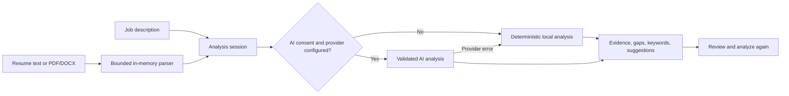

# ResumeMatch AI

> **Make the fit visible.**
>
> A privacy-first resume and job-description comparison tool that turns application feedback into grounded, practical next steps.

<p align="center">
  <a href="https://github.com/sumanth-bandla/ResumeMatch-Ai-">Repository</a>
  ·
  <a href="http://127.0.0.1:8000/">Local app</a>
  ·
  <a href="#quick-start">Quick start</a>
</p>

ResumeMatch AI compares resume evidence with a job description and reports recognizable matches, terms to review, questions to verify, readability observations, and conditional suggestions. The score is an estimate for personal review, never a hiring prediction or an employer ATS assessment.

## Product Highlights

| Capability | What it does |
| --- | --- |
| Evidence-led matching | Shows skills and experience that are explicitly present in the resume. |
| Local-first analysis | Runs without provider credentials or external data transfer. |
| PDF and DOCX parsing | Extracts selectable text in memory with bounded file and archive limits. |
| Optional AI assistance | Uses a configured provider only after per-analysis consent. |
| Revision workflow | Edit the extracted resume and analyze again in the same session. |
| Privacy controls | Uses expiring server memory, CSRF protection, secure headers, and no-store responses. |

## How It Works



## Quick Start

### Windows PowerShell

```powershell
py -3.11 -m venv .venv
.venv\Scripts\Activate.ps1
python -m pip install --upgrade pip
python -m pip install -r requirements.txt
Copy-Item .env.example .env
python -m uvicorn app.main:app --reload
```

### macOS or Linux

```bash
python3.11 -m venv .venv
source .venv/bin/activate
python -m pip install --upgrade pip
python -m pip install -r requirements.txt
cp .env.example .env
python -m uvicorn app.main:app --reload
```

Open [http://127.0.0.1:8000](http://127.0.0.1:8000) after the server starts.

## Optional AI Mode

Local analysis is the default. To enable optional OpenAI analysis, set these server-side values in `.env`:

```dotenv
AI_PROVIDER=openai
AI_MODEL=gpt-4o-mini
AI_API_KEY=replace-with-a-key
```

The application asks for consent on every analysis before sending resume data and the job description to the configured provider. If consent is declined, local analysis is used. Provider timeouts, malformed responses, and API errors fall back to local results.

Never place a real API key in source files, templates, browser JavaScript, or version control. `.env` is ignored by Git; `.env.example` contains placeholder names only.

## Testing

Run the full suite from the activated virtual environment:

```powershell
python -m pytest -q
```

The tests cover local scoring, AI response validation, PDF/DOCX extraction, CSRF protection, sample analysis, editing, consent, and start-over behavior.

## Privacy and Safety

- Resume data, job descriptions, and results stay in bounded, expiring server memory.
- No resume content is written to a database, temporary file, or permanent application storage.
- PDF uploads are limited to 5 MB and 40 pages; DOCX archive expansion is bounded.
- Password-protected and image-only documents receive a clear extraction error.
- Session cookies are HttpOnly and SameSite=Lax.
- POST forms validate a per-session CSRF token.
- Security headers and `Cache-Control: no-store` responses are enabled.
- Matching skills must be evidenced in the submitted resume.
- Missing qualifications are phrased as questions to verify, not as assumed gaps.

## Project Structure

```text
app/
  main.py                    FastAPI routes, sessions, and request flow
  config.py                  Environment-backed application settings
  services/
    analysis.py              Deterministic local scoring and guidance
    ai_provider.py           Optional provider adapter and response validation
    resume_parser.py         PDF/DOCX extraction and safety limits
    session_store.py         Expiring in-memory session storage
  static/                    CSS and browser JavaScript
  templates/                 Jinja2 pages
tests/                       Unit and route coverage
requirements.txt             Runtime and test dependencies
```

## Repository

Source code: [github.com/sumanth-bandla/ResumeMatch-Ai-](https://github.com/sumanth-bandla/ResumeMatch-Ai-)

## License

No license has been selected yet. Add a license before distributing the project publicly.
